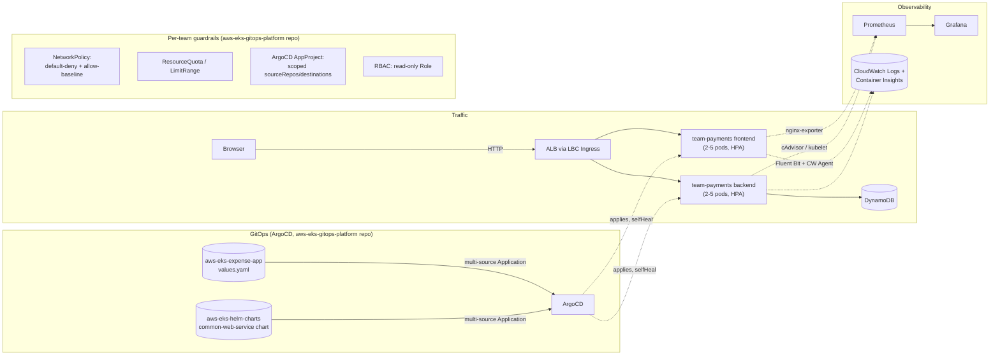

# expenseinfra — Layered AWS Infrastructure for a Multi-Tenant EKS Platform

Terraform repository for a **personal expense tracker demo** — originally built to compare three AWS runtime patterns (Lambda, ECS Fargate, EKS) from one codebase and weigh serverless vs. containers vs. orchestration trade-offs in a real AWS account. After that comparison, **EKS was chosen to go deep on**, and this repo evolved into a **layered, multi-environment Terraform setup** (`terraform-live/`) provisioning the infrastructure for a real multi-tenant Kubernetes platform. The Lambda/ECS modules from the original comparison are retired — this repo is EKS-only now.

See [`aws-eks-gitops-platform`](https://github.com/josephine-525/aws-eks-gitops-platform) for the full 8-repo picture and the platform's GitOps/isolation layer built on top of what this repo provisions.

---

## What this repo does

`terraform-live/` is **5 independent layers, each with its own state**, applied in dependency order — not one monolithic root module:

| Layer | Role |
|--------|------|
| **`terraform-live/environments/{dev,staging,prod}/network/`** | VPC, subnets, routing — per environment |
| **`terraform-live/environments/{dev,staging,prod}/db/`** | DynamoDB (expenses table) — per environment |
| **`terraform-live/environments/{dev,staging,prod}/security/`** | IAM not coupled to compute (EKS cluster/node roles, permission policies) — per environment |
| **`terraform-live/environments/{dev,staging,prod}/compute/`** | EKS cluster + node groups, IRSA roles, VPC CNI/CloudWatch Observability addons — per environment |
| **`terraform-live/account/`** | Account-wide, environment-independent: ECR repos, budget alerts |
| **`.gitlab-ci.yml`** | Per-layer `validate` → `plan` → manual **`apply`**, real dependency graph via `needs:` (see "GitLab CI/CD" below) |
| **`check-destroy-*.sh`** | Read-only AWS checks **after** destroy (not a substitute for `terraform destroy`) |

Every layer another layer depends on publishes its outputs as **SSM parameters** — the consuming layer reads them via `data "aws_ssm_parameter"`, never by reaching into another layer's state file directly. The actual reusable module code (VPC, EKS compute, IAM, ECR, DynamoDB) lives in a separate, independently-versioned repo: [`aws-eks-terraform-modules`](https://github.com/josephine-525/aws-eks-terraform-modules), consumed here via pinned git tags.

**Only `dev` has been built out and exercised live in this demo** — `staging`/`prod` have the same layer structure scaffolded but haven't been applied. Extending to a real multi-environment ArgoCD setup (registering `staging`/`prod` as separate ArgoCD-managed clusters instead of today's single in-cluster deployment) is a scoped next step, not a redesign.

**Application UI and business logic** live in a separate repo, [`aws-eks-expense-app`](https://github.com/josephine-525/aws-eks-expense-app) (`frontend/`, `backend/`). This repo does not build Docker images — that's the app repo's own CI.

---

## Architecture

GitHub renders **Mermaid** in Markdown; the diagram below shows up directly on the repo home page.



The **AWS Load Balancer Controller** creates the internet-facing ALB from **Ingress**; the EKS module uses a **dedicated VPC** and **IRSA** so workloads use short-lived credentials instead of long-lived keys. `team-payments` is one of three tenant namespaces on this cluster — `team-fraud-detection`/`team-analytics` (placeholder tenants, [`aws-eks-demo-teams`](https://github.com/josephine-525/aws-eks-demo-teams)) run the same guardrails, which is what makes the isolation layer something that's actually been tested cross-tenant, not just applied to one namespace and assumed to work.

Four separate concerns, each with its own access path (**none exposed publicly except the ALB**):
- **Traffic** — the only internet-facing path; everything else is `kubectl port-forward` only.
- **GitOps** — ArgoCD (not CI) is what actually applies manifests to the cluster and reverts manual drift (`selfHeal`); CI only builds images and bumps a tag in `values.yaml`.
- **Isolation** — enforced per-namespace, platform-owned, not editable by the tenant it constrains. See `aws-eks-gitops-platform`'s README for the live verification (and the real bugs found doing it).
- **Observability** — Prometheus/Grafana for dashboards; CloudWatch Observability addon (this repo's Terraform) for logs + Container Insights, independent of the Prometheus stack.

---

## Runtime comparison (historical — this is why EKS was chosen)

Before this repo became EKS-only, the same app was actually deployed to all three of these to compare them directly, not just on paper:

| | **Lambda** | **ECS Fargate** | **EKS** |
|---|------------|-----------------|---------|
| **Best for** | Low traffic, minimal ops | Containers without managing EC2 | Full orchestration, CRDs, team scale |
| **Compute** | Pay-per-invocation | Per-task vCPU/memory | Node groups + control plane cost |
| **Ingress** | API Gateway + CloudFront | ALB (Terraform-managed) | ALB via LBC + Ingress |
| **Ops overhead** | Lowest | Medium | Highest |

EKS won not because it's "best" — it's the highest-overhead option on this table — but because it's the one with the most real design surface: networking, multi-tenancy, GitOps, RBAC. That surface is what the rest of this repo (and the other 7 in this platform) is actually about.

---

## Observability (EKS)

`runtime-eks` installs the **`amazon-cloudwatch-observability`** EKS addon (declarative `aws_eks_addon`, own IRSA role scoped to `CloudWatchAgentServerPolicy`). It deploys Fluent Bit + CloudWatch Agent DaemonSets with zero manual YAML and writes to three Terraform-managed log groups (**14-day retention**, so they don't grow unbounded):

```
/aws/containerinsights/{project_name}-expense-eks/application   # pod stdout/stderr
/aws/containerinsights/{project_name}-expense-eks/host           # node-level logs
/aws/containerinsights/{project_name}-expense-eks/dataplane      # kubelet / container runtime
```

CPU/memory dashboards: CloudWatch console → **Container Insights → Performance monitoring**.

**Prometheus + Grafana + ArgoCD** are installed by **expenseapp**'s CI (Helm, in the `deploy-eks` job), not by this repo — see [`expenseapp/README.md`](../expenseapp/README.md#monitoring--observability-eks) for Grafana access, the custom dashboard, and the GitOps setup.

**Cross-repo values via SSM, not copy-pasted CI variables:** `runtime-eks` publishes IRSA role ARNs and the ALB security group ID to SSM under `/{project_name}/expense/...` (`eks-expense-backend-role-arn`, `eks-aws-lbc-role-arn`, `eks-alb-security-group-id`). expenseapp's CI reads these with `aws ssm get-parameter` at deploy time instead of a human copying Terraform outputs into GitLab CI/CD variables by hand — the values stay correct automatically across `terraform apply` runs.

---

## EKS version upgrades (control plane + node groups)

Practiced end-to-end on this cluster: **1.34 → 1.35**, zero downtime, zero pod restarts. The two halves are independent and upgraded separately — EKS does not couple them.

**1. Control plane** — bump `eks_kubernetes_version` in `terraform-live/environments/dev/compute/main.tf` by exactly **one minor version** (EKS rejects skipping, e.g. 1.34 → 1.36 directly) and run the normal pipeline. `terraform plan` should show only `aws_eks_cluster.expense[0].version` changing in-place (an `aws_iam_openid_connect_provider.eks[0].thumbprint_list` recompute is a harmless side effect — the OIDC issuer's cert thumbprint changes with the cluster, unrelated to IRSA permissions). AWS manages this upgrade with no control-plane downtime; running pods are completely unaffected (confirmed: pod `AGE`/restart counts didn't change across the upgrade).

**2. Node groups** — **not automatic.** Bumping the cluster version alone does nothing to node groups (confirmed empirically — a plan right after a control-plane-only upgrade showed zero node group changes). Both `aws_eks_node_group` resources now pin `version = var.eks_kubernetes_version` explicitly — that's what actually triggers the rolling node replacement (new EC2 launched on the new AMI/kubelet first, old node cordoned + drained once the new one is healthy, old instance terminated last). `update_config { max_unavailable = 1 }` is declared explicitly even though it matches the AWS default, so the rollout behavior is documented, not implied.

**Sequencing — one AZ at a time, not both node groups in the same apply:** a real rolling upgrade should never risk both AZs losing healthy capacity simultaneously. Since both node groups share `var.eks_kubernetes_version`, a normal `terraform apply` would upgrade both `expense_default` (AZ1) and `expense_apps` (AZ2) in the same run. To sequence them:

```bash
# AZ1 first — surgical, run locally (this is exactly the sanctioned use case for -target)
cd terraform-live/environments/dev/compute
terraform init
terraform plan  -target='module.compute.aws_eks_node_group.expense_default[0]'
terraform apply -target='module.compute.aws_eks_node_group.expense_default[0]'

# confirm AZ1 healthy (new node Ready, pods rescheduled, 0 restarts), THEN:
# AZ2 — normal pipeline run, no -target needed (AZ1 is already at the target
# version, so this plan only shows expense_apps changing)
```

**What actually kept this safe:** the `PodDisruptionBudget`s in expenseapp's `k8s/eks-workload.yaml` (`minAvailable: 2` of 3 replicas per Deployment). When a node happened to hold 2 of a Deployment's 3 replicas, the eviction API evicted them **one at a time** — evicting both at once would have dropped availability to 1/3, violating the PDB. Without a PDB, a single node drain can legally evict every pod on it simultaneously.

> **Gotcha worth remembering:** running `terraform plan` **locally without `-target`** produced a plan showing an EKS **access entry being destroyed** — a false signal. The GitLab pipeline exports `TF_VAR_eks_admin_principal_arn`/`TF_VAR_eks_ci_principal_arn` (`.gitlab-ci.yml`'s `.terraform_init_backend`) that a local shell doesn't have; without them, Terraform computes a different (wrong) plan for anything depending on those variables. `-target` limits scope to only the named resource and its dependencies, so the earlier AZ1 `-target` apply was never at risk — but a full, untargeted `apply` run **must** happen through the pipeline (or with the same env vars manually exported locally), never bare-`terraform apply` from a laptop against a project with CI-only input variables.

**At scale, this doesn't stay manual:** more nodes per AZ → `update_config`'s `max_unavailable`/percentage bounds how many replace at once within a node group; more AZs/regions → the same "prove it's healthy, then proceed" sequencing gets automated as pipeline stages instead of manual `-target` commands, often canarying one region before the rest. [Karpenter](https://karpenter.sh) is the more dynamic alternative to static managed node groups (drift detection replaces "bump `version` and apply" with a continuously-reconciling controller, and `NodePool.spec.disruption.budgets` replaces `update_config`) — not adopted here; this project intentionally stays on managed node groups since Karpenter's value (elastic, unpredictable-traffic fleets) doesn't apply to a fixed 2-node learning cluster.

---

## Usage (local)

Each layer is applied from its own directory — there's no single root `terraform apply` for the whole environment:

```bash
cd terraform-live/environments/dev/network   && terraform init && terraform apply
cd terraform-live/environments/dev/db        && terraform init && terraform apply
cd terraform-live/environments/dev/security  && terraform init && terraform apply   # after network+db
cd terraform-live/environments/dev/compute   && terraform init && terraform apply   # after all three
```

Key outputs after `compute`'s apply: `eks_cluster_name`, IRSA role ARNs — `terraform output` in that directory. In practice this always runs through the GitLab pipeline (below), not bare-`terraform apply` from a laptop — see the version-upgrade gotcha further down for why.

---

## GitLab CI/CD (**expenseinfra** vs **expenseapp**)

`expenseinfra`'s root `.gitlab-ci.yml` was rewritten (2026-09-21) for the `terraform-live/` layered structure, replacing the old single-project (`terraform/`) pipeline — that project is retired, this repo's CI only targets `terraform-live/dev` now.

| Repo | Responsibility |
|------|----------------|
| **expenseinfra** (this repo) | Per-layer `validate` → `plan` → **manual `apply`** for `dev/{network,db,security,compute}` + `account/{ecr,budget-alert}`, wired with GitLab `needs:` to enforce the real dependency graph; optional layered **destroy** pipeline with safety inputs |
| **expenseapp** | Cluster bootstrap (LBC/metrics-server/ArgoCD/monitoring namespace), Docker **build/push** to ECR, and workload/GitOps deploy |

**26 jobs, one per (layer × action)**, not one big `apply`. Dependency graph, enforced by `needs:` (not just stage order):

```
network ─┐
db ──────┼─→ security ─→ compute
         ┘
account/ecr, account/budget-alert: independent, no needs on anything.
```

`plan_security` needs `apply_db` (not just `plan_db`) — it reads `db`'s real SSM output, which only exists post-apply. `plan_compute` needs `apply_network` + `apply_security` for the same reason. Destroy direction is the reverse: `compute` → `security` → (`network`, `db`, `ecr` in parallel). **`account/budget-alert` has no destroy job at all** — it costs nothing to leave running (2 AWS Budgets total in this account, still inside the free tier) and is exactly what you want still watching spend on the way down. **`account/ecr` DOES have a destroy job**, deliberately, even though the "real company" design story is account-wide/survives-every-teardown — in this single-account learning setup the user is the only consumer and tears the whole footprint down between sessions, ECR included. `force_delete = true` on both repos means destroying it permanently deletes every pushed image tag; `destroy_plan_ecr`/`destroy_apply_ecr` wait specifically on `destroy_apply_compute` so the cluster (and anything that might still be pulling images) is already gone first.

**Required CI/CD variables**: `AWS_ACCESS_KEY_ID`, `AWS_SECRET_ACCESS_KEY`, `AWS_DEFAULT_REGION` (masked); `TF_MODULES_READ_TOKEN` (masked, `read_repository`, group-wide — `terraform-modules` is a separate private repo, module sources are `git::https://...` now, not SSH, since CI has no SSH key; reuse the same service-account token created for ArgoCD's repo-creds Secrets if convenient); optionally `EKS_ADMIN_PRINCIPAL_ARN`/`EKS_CI_PRINCIPAL_ARN` → `TF_VAR_eks_admin_principal_arn`/`TF_VAR_eks_ci_principal_arn`. **`EKS_CI_PRINCIPAL_ARN` must be the IAM principal this CI actually runs as**, or `destroy_precheck_compute`'s `kubectl` step (below) has no cluster access.

**Destroy automation, learned from a real incident (2026-09-20, see the troubleshooting log below)**: `destroy_precheck_compute` — its own job, `alpine:3.20`, runs before `destroy_apply_compute` — deletes the `team-payments-ingress` ArgoCD Application first (so `selfHeal` doesn't recreate what's about to be deleted), deletes the Ingress, and polls `aws elbv2 describe-load-balancers` until the LBC-managed ALB is actually gone — all **before** `terraform destroy` runs, since that ALB isn't in any Terraform state and destroying the cluster first would silently orphan it. The job fails loudly (`exit 1`) if the ALB is still there after 5 minutes, rather than proceeding into a destroy that would leak it. Do **not** patch Ingress finalizers to force this along — that's the one thing that reliably makes it worse (orphans the ALB permanently instead of just slowly). This cleanup is a separate job from `destroy_apply_compute` on purpose: `hashicorp/terraform:1.9`'s bundled Alpine base has a broken `aws-cli`/`pyexpat` combo (`Error relocating .../pyexpat...so: symbol not found` — a known musl/expat version mismatch, hit live 2026-09-21), while `terraform apply`/`plan` never need the external `aws` CLI at all (the provider uses its own Go SDK) — so the cleanup runs on `alpine:3.20` (the same base already proven working in `expenseapp`'s own `deploy-eks` job) instead of fighting the terraform image's version.

**Destroy**: run a **web** pipeline with `confirm_destroy=true` and `destroy_approval=YES_DESTROY_INFRA` (also requires a protected branch) — only the `destroy_*` jobs appear, in the same layered order, each `plan` then manual `apply`.

---

## EKS troubleshooting log

Real issues hit during EKS work; kept here as a reference.

| Symptom | Cause | Fix |
|---------|--------|-----|
| Access entry conflict on cluster creation | CI principal duplicated with bootstrap admin | Separate **admin** vs **CI** principal ARNs; admin reserved for human `kubectl` |
| ALB Controller failing to resolve VPC | Relying on metadata paths that failed in CI | Pass **`vpcId`** explicitly in Helm (`aws eks describe-cluster`) |
| IRSA annotations not applied | Placeholders / missing env in `envsubst` | Set real ARNs from Terraform outputs (`aws_lbc_role_arn`, `eks_expense_backend_irsa_role_arn`) |
| LBC **403** on AWS APIs | IAM policy gaps or **wrong tag condition** | Use the official LBC **v2** IAM policy (`elbv2.k8s.aws/cluster`, not v1 `ingress.k8s.aws/cluster`) |
| Backend **CrashLoopBackOff** | Probes hit **`/expenses`** without `?month=YYYY-MM` → **400** | Point readiness/liveness to **`/`** (stable **200**) |
| Target group **0** targets / **503** | Pod not Ready → not in Endpoints | Fix probes / IRSA upstream; TG recovers when Pod becomes Ready |
| Webhook **x509 unknown authority** after LBC upgrade | Webhook cert vs pod cert drift | **`keepTLSSecret=true`** in Helm; rollout restart LBC after upgrades before applying Ingress |
| `kubectl delete ingress` hangs; ALB stays **active** | IRSA could **create** the ALB but not **delete** it: IAM used v1 tag `ingress.k8s.aws/cluster`, LBC v2 tags ALBs with `elbv2.k8s.aws/cluster`. Finalizer never cleared. `get ingress` has no STATUS column — check yaml `deletionTimestamp`. CLASS `<none>` ≠ “LBC ignored it” if ADDRESS is set. | `spec.ingressClassName: alb` + official v2 IAM. Restart LBC after IAM apply (retry backoff). Do not patch finalizers. |
| Both EKS node groups landed in the **same AZ** despite a 2-AZ VPC | `subnet_ids` on both `aws_eks_node_group` resources listed **all** private subnets (both AZs); with `desired_size=1` each, the ASG picked whichever AZ it wanted — no guaranteed spread. **Zero real AZ fault tolerance** even though the VPC "supports" 2 AZs. | Pin `expense_default` to `aws_subnet.eks_private[0]` (AZ1) and `expense_apps` to `aws_subnet.eks_private[1]` (AZ2) — same node count, same cost, deterministic 1-per-AZ. Pair with pod `topologySpreadConstraints` on `topology.kubernetes.io/zone` (not just `kubernetes.io/hostname`) in expenseapp's `k8s/eks-workload.yaml`. |
| Bumping `eks_kubernetes_version` upgraded the control plane but node groups stayed on the old version | `aws_eks_node_group` had no `version` argument set — nothing ties node version to the cluster version by default | Set `version = var.eks_kubernetes_version` explicitly on both node groups (see "EKS version upgrades" below) |
| Local `terraform plan` (no `-target`) showed an EKS **access entry being destroyed** — false signal | Local shell was missing `TF_VAR_eks_admin_principal_arn`/`TF_VAR_eks_ci_principal_arn`, which the GitLab pipeline sets automatically; Terraform computed a different plan without them | Run full (non-`-target`) plans/applies **only** through the pipeline, or export the same `TF_VAR_*` values locally first. `-target` runs are safe regardless (scope-limited to the named resource) |

---

## `terraform-live` dev environment bring-up log (2026-09-20)

Separate from the table above — this is the newer `terraform-live/` + `terraform-modules` + `gitops` + `observability` multi-repo architecture (see those repos' own READMEs for the design), not the original single-account `terraform/` layout. First real end-to-end bring-up of the `dev` environment, done by hand (`.gitlab-ci.yml` is not yet rewritten for this environment — see `gitops`/`expenseapp` history). Real issues hit, in the order they were found:

| Symptom | Cause | Fix |
|---------|--------|-----|
| ArgoCD Applications stuck at `SYNC STATUS: Unknown`, `authentication required: HTTP Basic: Access denied` | ArgoCD repo-credential Secrets were created with a bash `for repo in ...` loop; `${repo}` never interpolated, so all 5 Secrets stored the literal string `${repo}.git` instead of the real repo name | Recreate each Secret with a hardcoded URL, no loop |
| `kubectl apply -f expense-teams.yaml` → `error converting YAML to JSON: ... could not find expected ':'` | A bare `{{- if .hasHPA }} ... {{- end }}` Go-template conditional inside the ApplicationSet's shared `template:` block is not valid YAML on its own — `kubectl` has to parse the file before any Go-template rendering happens | Removed the conditional; apply `ignoreDifferences` on `spec.replicas` unconditionally to all 4 elements (harmless no-op for the 2 without an HPA) |
| ApplicationSet rejected: `spec.generators[0].list.template.spec.destination: Required value` (and similar for `metadata`/`project`) | First fix attempt used a per-generator `template` override scoped to just the HPA elements; ArgoCD requires any generator-level `template` to carry a complete Application spec of its own — it doesn't partially merge into the top-level template | Back to one generator, one full top-level template |
| Applications stayed `OutOfSync`/`Unknown` even after repo-creds were fixed | `repoURL`/`valuesRepoURL` fields were SSH format (`git@gitlab.com:...`); the repo-creds Secrets are HTTPS+token — ArgoCD matches credentials to sources by exact URL string, SSH and HTTPS never match the same credential | Converted every `repoURL`/`valuesRepoURL` across `expense-teams.yaml`, `kube-prometheus-stack.yaml`, `observability-dashboards.yaml` to HTTPS |
| Pods `ErrImagePull`: `no match for platform in manifest` | First manual image push (`manual-1`) was built with plain `docker build` on Apple Silicon, no `--platform` flag → arm64-only image; EKS nodes are amd64 (`t3.medium`) | Rebuild with `--platform linux/amd64` (now a standing requirement for every manual build on this Mac) |
| Frontend nginx `CrashLoopBackOff`: `host not found in upstream "expense-backend"` | `frontend/nginx-eks.conf` proxied to `expense-backend:8080` — a Service name from the retired hand-written `k8s/eks-workload.yaml` manifests. The real chart-generated Service is `team-payments-backend-common-web-service:80` (release+chart name; the chart's Service always listens on 80 regardless of the container's own `targetPort`) | Fixed the upstream name/port in `nginx-eks.conf`; rebuilt the image (config is baked in at build time) |
| kube-prometheus-stack's largest CRDs (`prometheuses`, `alertmanagers`, `thanosrulers`, `scrapeconfigs`, `prometheusagents`, `alertmanagerconfigs`) failed: `metadata.annotations: Too long: may not be more than 262144 bytes` | Client-side apply embeds the full ~640KB CRD manifest into the `kubectl.kubernetes.io/last-applied-configuration` annotation, exceeding the 262144-byte limit. Adding `ServerSideApply=true` and even `Replace=true` to the Application's `syncOptions` did **not** fix it — confirmed live with guaranteed-fresh sync attempts — because this ArgoCD version still does a plain client-side `Create` (annotation and all) the first time a resource doesn't exist yet, regardless of those options; they only apply to later updates | One-time `kubectl apply --server-side --force-conflicts -f <crd-file>` for each of the 6 oversized CRDs, bypassing ArgoCD entirely for just that bootstrap moment. Subsequent ArgoCD syncs hit the update path and work fine |
| Prometheus/Alertmanager custom resources existed but no StatefulSet/pod ever appeared | The Prometheus Operator checks which CRDs exist **once, at its own startup**, and never rechecks — it had already logged `resource "prometheuses" ... not installed in the cluster` before the CRD bootstrap above happened, and doesn't dynamically pick up newly-created CRDs | `kubectl -n monitoring rollout restart deployment/kube-prometheus-stack-operator` — controllers synced within ~15s, no restart-loop needed |
| Every DynamoDB call from the backend failed: `AccessDenied: Not authorized to perform sts:AssumeRoleWithWebIdentity` | The `expense-backend` IRSA role's OIDC trust policy was **hardcoded** inside `terraform-modules/compute` to `system:serviceaccount:expense:expense-backend` — the old `expenseinfra/terraform` project's namespace/ServiceAccount name, inside a module whose own design rule is "zero env-specific hardcoding." Real ServiceAccount is `team-payments/team-payments-backend-common-web-service` | Added required (no-default) `eks_expense_backend_sa_namespace`/`eks_expense_backend_sa_name` variables, breaking-change bump to `terraform-modules` **v2.0.0**, real values passed from `environments/dev/compute`, applied (`terraform plan`: 1 in-place IAM change only) |
| Grafana's "Expense App" dashboard rendered every panel empty | All 9 PromQL queries in `expenseapp/dashboards/expense-grafana-dashboard.yaml` hardcoded `namespace="expense"` | Replaced with `namespace="team-payments"`, pushed, ArgoCD's `dashboard-expenseapp` Application resynced |

**Pattern across 3 of these** (nginx upstream, IRSA trust policy, Grafana dashboard): a leftover reference to the retired `expense`/`expense-backend`/`expense-frontend` naming scheme, silently wrong under the new `team-payments`/`common-web-service`-chart naming, never caught until something was actually exercised end-to-end. `expenseapp/k8s/expense-prometheus-rules.yaml` has the same hardcode but is currently dormant (not deployed by anything in this environment) — left as-is along with the rest of the retired `k8s/` GitOps flow.

---

## Team isolation build + live verification log (2026-09-23/24)

`gitops` gained a full multi-tenant "team isolation" layer this session: per-team `NetworkPolicy` (default-deny + allow-baseline), `ResourceQuota`/`LimitRange`, ArgoCD `AppProject`s, and a read-only RBAC `Role`/`RoleBinding` (see `gitops/README.md`'s design-decisions section for the *why* behind each). Building it was the easy part — verifying it live against the real cluster surfaced 7 real bugs, most of them "it looks like it worked but didn't":

| Symptom | Cause | Fix |
|---------|--------|-----|
| `platform` AppProject sync failed: `namespace kube-system is not permitted` | kube-prometheus-stack also creates Services in `kube-system` (control-plane scraping), not just `monitoring` — confirmed via `helm template ... \| grep namespace:` | Added `kube-system` to the `platform` AppProject's `destinations` |
| `team-fraud-detection`/`team-analytics` pods rejected: `maximum cpu usage per Container is 200m, but limit is 500m` | CloudWatch Observability's mutating webhook auto-injects 4 OpenTelemetry init containers (java/nodejs/python/dotnet — it can't know the app's language ahead of time) into **every** pod, each hardcoded to `limits.cpu: 500m`; the namespace's `LimitRange` `max` (200m, sized for the app container alone) rejects the whole pod outright | `LimitRange` max raised 200m→600m; `ResourceQuota` `limits.cpu` raised 500m→1200m (500m was exactly one pod's ceiling with zero rollout headroom — effective quota need is `max(app containers, largest single init container)`, doubled for a rolling update) |
| A "fixed" `LimitRange` kept showing the old `200m` value live even after a successful-looking pipeline re-run | A Python one-liner (`content.split('---')`/rejoin) used to patch an explanatory YAML comment silently **dropped the entire `LimitRange` document** from the multi-doc YAML file — it still parsed as valid (single-document) YAML, so nothing errored | Full Read+rewrite of the file (never string-split a multi-document YAML again); added `ruby -ryaml -e "YAML.load_stream(...).size"` as a pre-commit document-count check |
| Manually re-triggering an ArgoCD sync via `kubectl patch application ... -p '{"operation":{"sync":{...}}}'` re-broke an already-fixed bug (kube-prometheus-stack's CRDs failing `metadata.annotations: Too long`) | A manual `.operation.sync` patch does **not** automatically inherit the Application's own `spec.syncPolicy.syncOptions` — omitting `syncOptions` in the patch silently drops `ServerSideApply=true`/`Replace=true` that the Application's own spec had already set to work around exactly this CRD-size bug. `argocd.argoproj.io/refresh=hard` doesn't fix it either — it only recomputes the diff, it doesn't clear or reissue the stale operation | Always pass the same `syncOptions` explicitly in any manual `kubectl patch`-triggered sync — never assume they're inherited from spec |
| Prometheus/Alertmanager CRs existed with zero Events, no StatefulSet ever appeared — **again** (same root cause as the 2026-09-20 entry above, different trigger this time) | The bug above meant the CRD-size fix briefly regressed mid-session, which raced the Prometheus Operator's own pod restart — it checks which CRDs exist once, at its own startup, and never rechecks | `kubectl -n monitoring rollout restart deployment/kube-prometheus-stack-operator` once the CRDs were genuinely present |
| **NetworkPolicy objects applied cleanly and did absolutely nothing** — a cross-namespace connectivity test that should have timed out (blocked by `default-deny`) succeeded instead | AWS VPC CNI's NetworkPolicy enforcement is **off by default**. `kubectl get daemonset aws-node -n kube-system` showed the `aws-eks-nodeagent` container (the actual enforcement component) running with `--enable-network-policy=false` — every `NetworkPolicy` had been a no-op since the very first build, undetected until an actual connectivity test was run | Added `aws_eks_addon "vpc_cni"` to `terraform-modules`'s `compute` module (**v2.2.0**) with `configuration_values = jsonencode({ enableNetworkPolicy = "true" })`, adopting the previously self-managed/untracked install. **`kubectl apply` succeeding on a NetworkPolicy is not evidence it's enforced — only a live connectivity test is; the CNI itself is a separate, silent point of failure.** |
| Applying the fix above showed `terraform plan: 13 to add` instead of the expected 1 | 12 of the 13 were `aws_ec2_tag` resources (`kubernetes.io/cluster/<name>=shared`, `kubernetes.io/role/internal-elb`/`elb` — tags AWS Load Balancer Controller needs for subnet auto-discovery) that Terraform state already tracked as applied, but `aws ec2 describe-tags` confirmed those specific tags were genuinely missing from the live subnets — real drift, root cause not investigated, confirmed unrelated to this session's own changes (`git log` showed no other commits touching that code path) | Judged safe since the plan was 100% additive (`0 to change, 0 to destroy`) — applied together with the `vpc_cni` fix, restoring the missing tags |

**After the VPC CNI fix, re-verified from scratch**: cross-namespace connectivity now correctly times out; same-namespace connectivity and DNS still work; and — the one design risk flagged as "unverified" since the original NetworkPolicy design discussion — a check across all 3 team namespaces' pods showed 0 restarts and no `Unhealthy` events, confirming the `allow-baseline` policies' `ipBlock`-on-VPC-CIDR rule for ALB/kubelet probe traffic doesn't get broken now that enforcement is actually on.

**Takeaway worth repeating in an interview**: almost every bug in this table has the same shape — a resource "existed successfully" (an object in the API, a `kubectl apply` exit code, a Sync status) while the actual runtime behavior it was supposed to produce silently wasn't there. The fix pattern was always the same: don't trust the control-plane's opinion of itself, run the real behavior (a connectivity test, `aws ec2 describe-tags`, `kubectl get pod -o json` on the actual live object) and compare it to what the config claims.

---

## App features (product)

Implemented in **expenseapp** (not this repo): expense entry with categories, voice input, monthly budget indicator, EN/中文 toggle, demo mode.

---

## Notes (intentional scope)

- **No HTTPS / custom domain** in this demo — suitable for bring-up and teardown. ACM + Route 53 are understood but omitted to reduce cost and moving parts.
- **ArgoCD is in scope** (see expenseapp README) — installed via Helm in expenseapp's CI, not this repo. It manages only the EKS app manifests (`k8s/rendered/` in expenseapp); this repo's own Terraform-managed resources are unaffected by it.

---

## Diagrams: Mermaid vs image

- **Mermaid in this README** — version-controlled, renders on **GitHub** without extra assets.
- **Optional PNG/SVG** — add under `docs/` if you want the same diagram in slides or a PDF resume; not required for GitHub readers.

---

## Before publishing to a **public** GitHub fork

This is exactly what [`aws-eks-infra`](https://github.com/josephine-525/aws-eks-infra) (the public copy of this repo) went through — not a hypothetical checklist:

- **Every `terraform-live/**/backend.tf`** — S3 state bucket name, DynamoDB lock table name, replaced with a generic placeholder across all files in one pass.
- **`project_name`** (used for the cluster name, ECR repo names, tags) — replaced with a generic placeholder everywhere it appears, not just in one tfvars file.
- **`.terraform/`, `*.tfstate*`, `*.tfplan`, `pulled-state.json`** — excluded from the copy entirely, not just gitignored (a raw file copy picks up gitignored files too).
- Scanned for the real AWS account ID and anything credential-shaped (access keys, private key blocks, hardcoded passwords) before pushing — came back clean, since credentials only ever live in GitLab CI/CD variables, never in a committed file.

Remote state bucket and lock table **stay in your AWS account** until you delete them manually; they are **not** removed by `terraform destroy` from this project.

---

## Frontend / backend language

Infra comments and this README are **English**. UI strings and API messages are localized in **expenseapp**.
